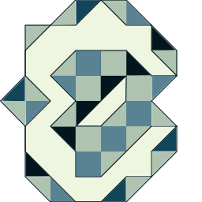

# Cíonom
#### \tʃi-o-nom\
*A tiny language*

[](https://discord.gg/uw5rp8SVM8)
[](https://esolangs.org/wiki/C%C3%ADonom)

Cíonom is a small language intended to be very easy to define (famous last words). In fact it's so simple that it isn't turing complete! Cionom defers to external code for branching and manipulation of memory.

The symbols used by the language are as follows:
```
:
```
And no keywords!

Its core grammar is designed non-self-referentially meaning it can be described in a single sentence or programs validated with a single regex.

### Structure
- [`SPECIFICATION.md`](SPECIFICATION.md) contains the specification of the language.
- The `examples/` folder contains some example Cíonom code.
- The `implementation/` folder contains a reference implementation.
